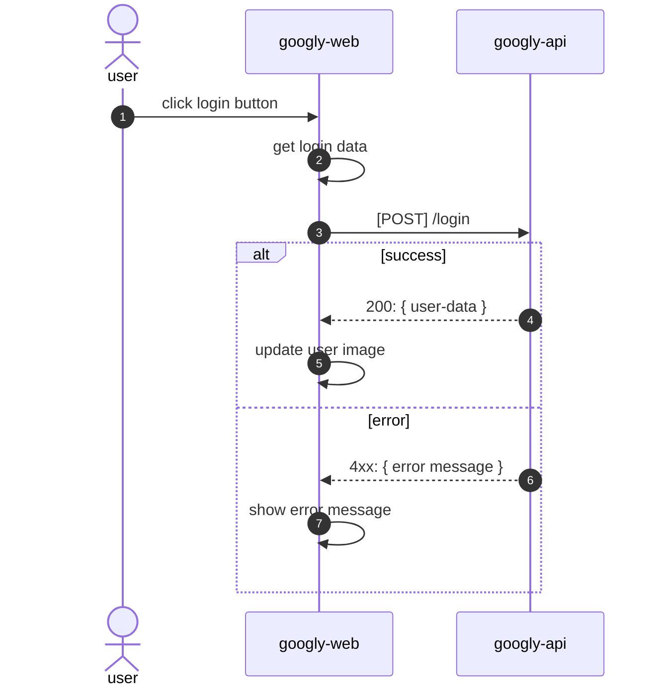

# Googly - API


## API Spec

In this section you will find the key documentation to use the Googly Restful API.

### API Documentation

```yml
# Login Endpoint 🔓
# You should use the following endpoint to do login.
endpoint: "http://127.0.0.1:8000/login"
http-method: "POST"
json-body: >
  {
    "nickname": "username",
    "password": "secret password"
  }
possible-errors:
  - http-code: 401
    meaning: The login and password doesn't match!
  - http-code: 404
    meaning: User doesn't exist in the database.
```

### Login Flow

This diagram shows how the web application interacts with the api to do the login.



## Developer Quick Start

Here are the steps you need to execute in order to have the API up and running.

### Python Virtual Environment

You need to **create** the virtual environment **only once**!  
If you don't have a `.venv/` yet, then do the following steps.

```bash
# 👇 Checking your Python version
python3 --version # 3.9.6

# 👇 Virtual Environment
python3 -m venv .venv \
  && source .venv/bin/activate \
  && python -m pip install --upgrade pip

# 👇 Dependencies
pip install -r api/requirements.txt
```

If you already have, you just have to activate it...

```bash
source .venv/bin/activate
```

To start the API, you just need to run the following commands.

```bash
# Check in your browser 👉 http://127.0.0.1:8000
fastapi dev api/main.py
```

_For more details about Fast API, check their [documentation]._

[documentation]: https://fastapi.tiangolo.com/
